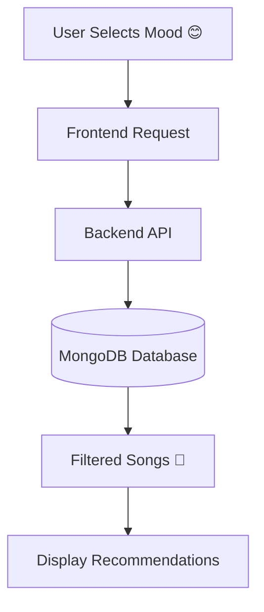

# 🎵 Mood-Based Music Recommendation System

<div align="center">


<br/>


</div>

---

# 🌟 Overview

🎧 A smart and interactive web application that recommends songs based on the user's current mood.

Whether you're feeling:

* 😊 Happy
* 😢 Sad
* ⚡ Energetic
* 😌 Calm

the system helps users discover the perfect music instantly.

---

# ✨ Features

🚀 Mood-based music recommendation
🎨 Modern & responsive UI
⚡ Fast backend APIs
🍃 MongoDB integration
🔍 Filter songs by mood & genre
🤖 Extendable AI recommendation support
📱 Mobile-friendly interface

---

# 🛠️ Tech Stack

<div align="center">

| Technology           | Purpose              |
| -------------------- | -------------------- |
| ⚛️ React + Vite      | Frontend             |
| 🚀 Node.js + Express | Backend              |
| 🍃 MongoDB           | Database             |
| 🎨 CSS               | Styling              |
| 🤖 ML Model          | Recommendation Logic |

</div>

---

# 📂 Project Structure

```bash
Mood-based-music/
│
├── frontend/
│   ├── src/
│   ├── components/
│   ├── pages/
│   └── assets/
│
├── backend/
│   ├── config/
│   ├── controllers/
│   ├── middleware/
│   ├── routes/
│   └── server.js
│
├── ml-model/
│
├── package.json
└── README.md
```

---

# ⚙️ Installation

## 🔹 Clone Repository

```bash
git clone https://github.com/Tanyav-rshney/Mood-based-music.git
cd Mood-based-music
```

---

## 🔹 Backend Setup

```bash
cd backend
npm install
npm start
```

---

## 🔹 Frontend Setup

```bash
cd frontend
npm install
npm run dev
```

---

# 🌐 Environment Variables

Create a `.env` file inside the backend folder.

```env
MONGO_URI=your_mongodb_connection_string
PORT=5000
JWT_SECRET=your_secret_key
```

---

# 🎯 Application Workflow



---

# 📸 Preview

> Add project screenshots here

### Suggested Screenshots:

* 🏠 Homepage
* 🎵 Recommendation Page
* 😊 Mood Selection UI
* 📱 Mobile Responsive View

---

# 🚀 Future Enhancements

* 🤖 AI-powered recommendations
* 🎵 Spotify API integration
* 🔐 Authentication system
* ❤️ Favorite playlists
* 🌙 Dark mode support

---

# 🤝 Contributing

Contributions are welcome!

If you'd like to improve this project:

1. Fork the repository
2. Create a new branch
3. Commit your changes
4. Submit a Pull Request

---

# 👩‍💻 Author

### Tanya Varshney

💡 Passionate about Frontend Development, MERN Stack & Creative UI Design.

---

# ⭐ Support

If you found this project helpful:

🌟 Star this repository
🍴 Fork the project
📢 Share it with others

---

<div align="center">

### 🎶 "Music expresses what words cannot."

</div>
