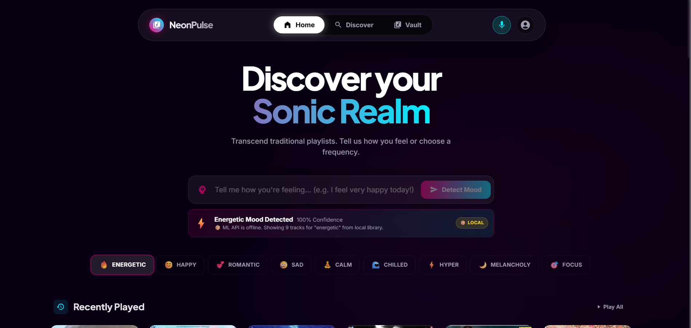
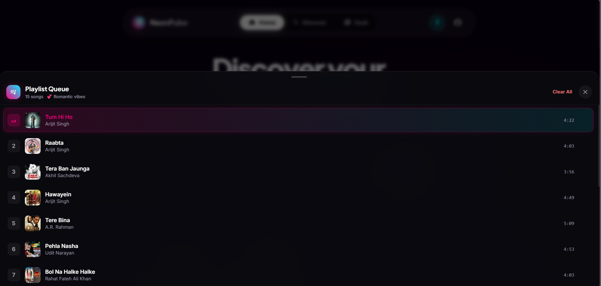
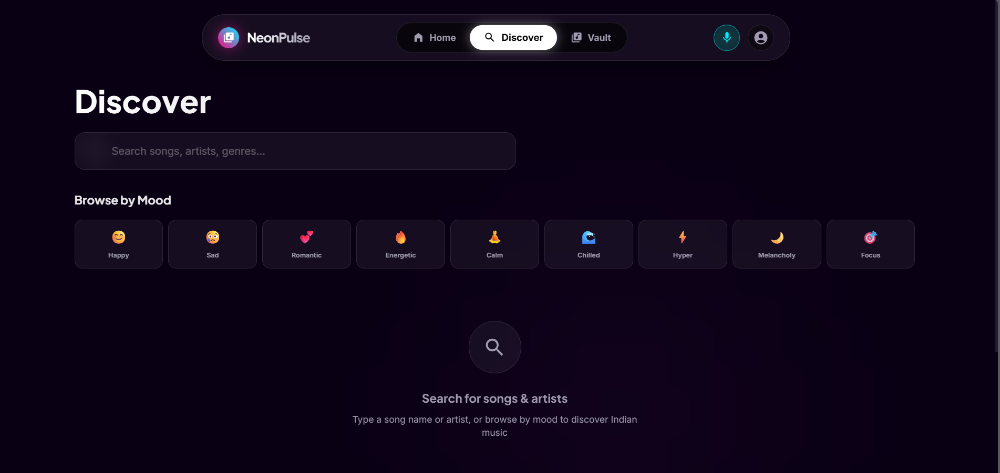
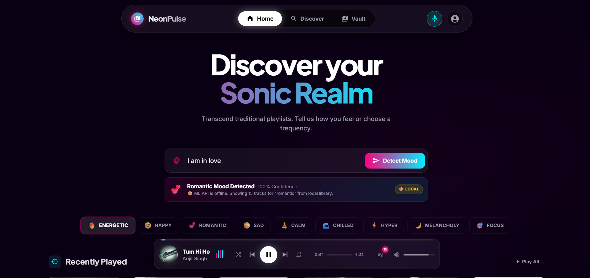
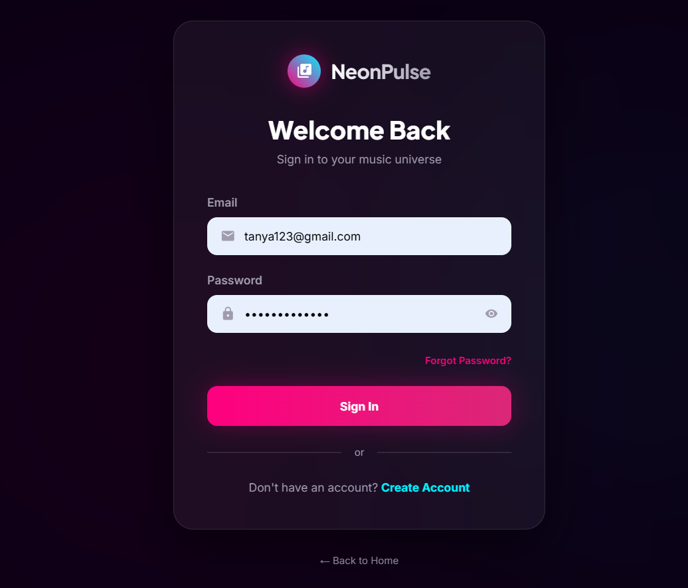
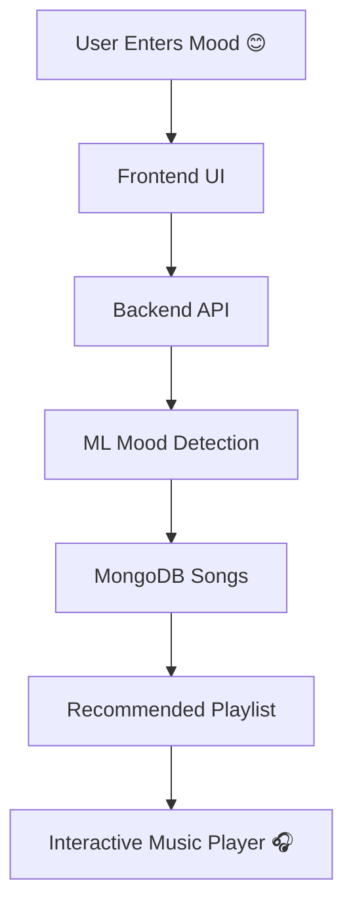

<div align="center">

# 🎵 NeonPulse — Mood Based Music Recommendation System


<br/>


<br/><br/>


</div>

---

<div align="center">

## 🌟 Experience Music Based on Your Emotions

🎧 An AI-powered futuristic music recommendation platform that understands user emotions and creates the perfect vibe playlist instantly.

✨ Happy, Sad, Energetic, Romantic or Calm — discover the perfect soundtrack for every emotion.

</div>

---

# 🚀 Live Demo

<div align="center">

[](YOUR_DEPLOY_LINK)

</div>

---

# 📸 Project Preview

<div align="center">

## 🏠 Home Page



<br/><br/>

## 🎵 Playlist Queue



<br/><br/>

## 🔍 Discover Section



<br/><br/>

## 🎧 Music Player



<br/><br/>

## 🔐 Authentication Page



</div>

---

# ✨ Core Features

<div align="center">

| Feature                  | Description                       |
| ------------------------ | --------------------------------- |
| 🎭 Mood Detection        | Detects user emotions from text   |
| 🎵 Smart Recommendations | Suggests songs according to mood  |
| 🎧 Interactive Player    | Modern music player with controls |
| ⚡ Fast Backend           | Built with Node.js & Express      |
| 🍃 MongoDB Database      | Structured song & user storage    |
| 🔍 Discover System       | Browse songs, artists & playlists |
| 🔐 Authentication        | Login & registration system       |
| 🤖 AI Ready              | ML-powered recommendation support |

</div>

---

# 🛠️ Tech Stack

<div align="center">


</div>

---

# 📂 Folder Structure

```bash
Mood-based-music/
│
├── frontend/
│   ├── src/
│   ├── components/
│   ├── pages/
│   └── assets/
│
├── backend/
│   ├── config/
│   ├── controllers/
│   ├── middleware/
│   ├── routes/
│   └── src/
│
├── ml-model/
│   ├── ml_api.py
│   ├── spotify_songs.csv
│   └── requirements.txt
│
└── README.md
```

---

# ⚙️ Installation Guide

## 🔹 Clone Repository

```bash
git clone https://github.com/Tanyav-rshney/Mood-based-music.git
cd Mood-based-music
```

---

## 🔹 Backend Setup

```bash
cd backend
npm install
npm run dev
```

---

## 🔹 Frontend Setup

```bash
cd frontend
npm install
npm run dev
```

---

## 🔹 ML Model Setup

```bash
cd ml-model
pip install -r requirements.txt
python ml_api.py
```

---

# 🌐 Environment Variables

Create `.env` file inside backend folder.

```env
PORT=5000
MONGO_URI=your_mongodb_connection
JWT_SECRET=your_secret_key
EMAIL_USER=your_email
EMAIL_PASS=your_password
```

---

# 🎯 Application Workflow



---

# 💎 UI Highlights

✨ Futuristic Neon Design
✨ Smooth Glassmorphism Effects
✨ Interactive Music Player
✨ Animated Transitions
✨ Modern Responsive Layout
✨ Cyberpunk Inspired Theme

---

# 🚀 Future Enhancements

🎤 Voice-Based Mood Detection
🎧 Spotify API Integration
🤖 Advanced AI Recommendations
🌙 Dark Mode Support
📱 Mobile Application
🌍 Social Playlist Sharing

---

# 👩‍💻 Developer

<div align="center">

## Tanya Varshney

💻 MERN Stack Developer
🎨 Frontend Enthusiast
🚀 Passionate About Creative UI & AI-Based Experiences

</div>

---

# ⭐ Support

<div align="center">

If you like this project:

⭐ Star this Repository
🍴 Fork this Project
💙 Share with Others

</div>

---

<div align="center">

# 🎶 “Music changes emotions. NeonPulse understands them.” 🎶

</div>
