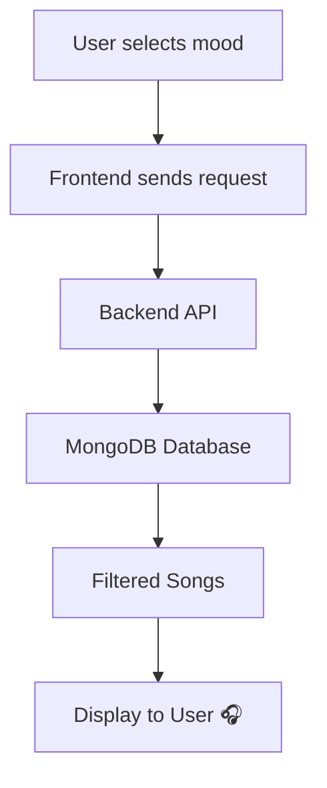

# 🎵 Mood-Based Music Recommendation System

<p align="center">
  
  
  
  
</p>

---

## 🌟 Project Overview

🎯 A smart web application that recommends songs based on the user's **mood**.

💡 Whether you're feeling 😊 happy, 😢 sad, ⚡ energetic, or 😌 calm — this system suggests the perfect music for you.

---

## ✨ Key Features

* 🎧 Mood-based music recommendations
* 📂 Organized MongoDB database
* ⚡ Fast and scalable backend
* 🎨 Interactive and modern UI
* 🔍 Easy filtering by mood & genre
* 📈 Extendable for AI recommendations

---

## 🛠️ Tech Stack

| Technology           | Usage       |
| -------------------- | ----------- |
| ⚛️ React (Vite)      | Frontend UI |
| 🚀 Node.js + Express | Backend API |
| 🍃 MongoDB           | Database    |

---

## 📂 Project Structure

```bash
music_recommendation/
│
├── backend/
│   ├── config/
│   ├── controllers/
│   ├── middleware/
│   ├── models/
│   ├── routes/
│   └── server.js
│
├── frontend/
│   ├── src/
│   ├── components/
│   └── assets/
│
└── README.md
```

---

## ⚙️ Installation Guide

### 🔹 Step 1: Clone Repository

```bash
git clone https://github.com/Tanyav-rshney/Mood--based-music.git
cd Mood--based-music
```

---

### 🔹 Step 2: Backend Setup

```bash
cd backend
npm install
npm start
```

---

### 🔹 Step 3: Frontend Setup

```bash
cd frontend
npm install
npm run dev
```

---

## 🌐 Environment Variables

Create `.env` file inside backend folder:

```env
MONGO_URI=your_mongodb_connection_string
PORT=5000
```

---

## 🎯 Working Flow



---

## 📸 Screenshots

> ⚠️ Add your project screenshots here for better presentation

---

## 🚀 Future Enhancements

* 🤖 AI-based recommendations
* 🎵 Spotify API integration
* 🔐 User authentication system
* 📱 Fully responsive design

---

## 👥 Team Members

* 👩‍💻 Tanya Varshney
* 👩‍💻 Tanisha Sharma
* 👨‍💻 Tanmay Gulati

---

## ⭐ Show Your Support

If you like this project:

👉 Give it a ⭐ on GitHub
👉 Share with your friends

---


